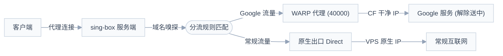

# Cloudflare WARP 解决 Google 送中问题

本自动化脚本专为解决自建节点、境外 VPS 出口 IP 遭遇 **“Google 送中”**（被识别为中国大陆导致 Google 搜索强制跳转、Gemini/Google One 无法使用、YouTube Premium 画中画与后台播放受限等）而设计。适用于 sing-box 代理。

通过配置官方 **Cloudflare WARP 运行于本地 SOCKS5 代理模式**，并结合 **sing-box 规则路由分流**，实现：
- 目标流量分流：Google、YouTube、Gemini 相关域名及 IP 流量经由 Cloudflare WARP 出口送达；
- 其他常规流量仍走 VPS 原生网络出口，避免性能损耗；
- WARP 仅监听于本地回环地址（`127.0.0.1:40000`），不接管 VPS 主网关与路由表，不影响 SSH 远程连接与原有服务。

---

## 架构拓扑



---

## 一键自动化安装

适用于 **Debian 11/12+** 或 **Ubuntu 20.04/22.04/24.04+** 系统。

### 方式 1：直接在远程服务器上运行
登录你的 VPS 执行以下命令：
```bash
curl -fsSL https://raw.githubusercontent.com/cfm019/warp2google/main/setup_warp_singbox.sh | sudo bash
```
或下载本地执行：
```bash
sudo bash setup_warp_singbox.sh
```

### 方式 2：从控制机通过 SSH 一键推送到远程服务器
如果你在本地管理多台服务器，可直接通过标准 SSH 管道推送到目标机器执行：
```bash
ssh root@<YOUR_SERVER_IP> "bash -s" < setup_warp_singbox.sh
```

### 方式 3：随时独立进行状态与属地诊断 (check-warp.sh)
若只需排查当前 WARP IP 是否被 Google/YouTube 送中，无需重新配置 sing-box，可直接运行独立自检脚本：
```bash
curl -fsSL https://raw.githubusercontent.com/cfm019/warp2google/main/check-warp.sh | bash
```
> [!NOTE]
> 诊断脚本默认检测本地 SOCKS5 端口 `40000`，如使用自定义端口可直接传参，例如 `bash check-warp.sh 40001`。
> 脚本将直观展示当前 WARP IPv4 / IPv6、Google 搜索重定向状态、YouTube 权威判定地区（解析 `VISITOR_PRIVACY_METADATA` 确认是否支持 Premium）及与 VPS 原生出口的对比：
> ```text
> ==============================================================
>        Cloudflare WARP 出口 IP 与属地分流检测报告
> ==============================================================
>  WARP IPv4 地址 : 104.28.xxx.xxx
>  WARP IPv6 地址 : 2a09:bac5:xxxx::xxxx
> --------------------------------------------------------------
>  Google 搜索状态: 正常 (未送中，停留在 google.com)
>  YouTube 判定区 : JP (正常，解除送中，支持 YouTube Premium)
> --------------------------------------------------------------
>  VPS 原生出口 IP: 198.51.100.xxx (YouTube 判定: CN)
> ==============================================================
> ```

### 方式 4：一键卸载与还原配置 (uninstall_warp_singbox.sh)
如需卸载 WARP 并将 sing-box 还原为初始直连状态：
```bash
curl -fsSL https://raw.githubusercontent.com/cfm019/warp2google/main/uninstall_warp_singbox.sh | sudo bash
```
*(支持追加 `--keep-warp` 保留 WARP 客户端，或手动传入配置文件路径)*

> [!TIP]
> 部署脚本具备**幂等性**与**语法回滚机制**：
> - 自动查找常见配置文件路径（如 `/etc/vless-reality/singbox.json` 或 `/etc/sing-box/config.json`）；
> - 修改前自动创建带时间戳的 `.bak` 备份文件；
> - 修改后自动调用 `sing-box check` 进行语法自检，出错自动回滚。

---

## 手动配置指引 (逐步拆解)

若你想手动配置或集成到现有体系中，可按以下步骤操作：

### 1. 安装 Cloudflare WARP 官方客户端
以 Debian 12 为例：
```bash
# 导入官方 GPG 密钥
curl -fsSL https://pkg.cloudflareclient.com/pubkey.gpg | gpg --yes --dearmor --output /usr/share/keyrings/cloudflare-warp-archive-keyring.gpg

# 添加 APT 源
echo "deb [signed-by=/usr/share/keyrings/cloudflare-warp-archive-keyring.gpg] https://pkg.cloudflareclient.com/ $(lsb_release -cs) main" | tee /etc/apt/sources.list.d/cloudflare-client.list

# 安装
apt-get update && apt-get install -y cloudflare-warp
```

### 2. 将 WARP 配置为 SOCKS5 本地代理模式
```bash
# 注册客户端
warp-cli --accept-tos registration new

# 设置为 SOCKS5 Proxy 模式并指定端口 40000
warp-cli --accept-tos mode proxy
warp-cli --accept-tos proxy port 40000

# 启动并连接
warp-cli --accept-tos connect

# 检查运行状态 (应显示 Connected / Network: healthy)
warp-cli --accept-tos status

# 验证本地 SOCKS5 代理出口
curl -s -x socks5://127.0.0.1:40000 https://api.ip.sb/geoip
```

### 3. 下载离线规则集 (`.srs`)
为了启动时不依赖外部 HTTP 客户端、实现零延迟解析，推荐将二进制规则集下载至配置目录（例如 `/etc/sing-box/`）：
```bash
CONFIG_DIR="/etc/sing-box"

# Google 域名集合
curl -sSL https://raw.githubusercontent.com/SagerNet/sing-geosite/rule-set/geosite-google.srs -o "$CONFIG_DIR/geosite-google.srs"

# YouTube 域名集合
curl -sSL https://raw.githubusercontent.com/SagerNet/sing-geosite/rule-set/geosite-youtube.srs -o "$CONFIG_DIR/geosite-youtube.srs"

# Google IP CIDR 集合 (用于捕获客户端直连 IP 或 DNS 预解析流量)
curl -sSL https://raw.githubusercontent.com/MetaCubeX/meta-rules-dat/sing/geo/geoip/google.srs -o "$CONFIG_DIR/geoip-google.srs"
```

### 4. 调整 sing-box 配置文件
在 sing-box 的 `config.json` 中配置对应的 `outbounds` 与 `route` 分流：

```json
{
  "log": {
    "level": "warn",
    "timestamp": true
  },
  "inbounds": [
    {
      "type": "vless",
      "tag": "vless-in",
      "listen": "::",
      "listen_port": 443,
      "users": [
        {
          "name": "default-user",
          "uuid": "00000000-0000-0000-0000-000000000000",
          "flow": "xtls-rprx-vision"
        }
      ],
      "tls": {
        "enabled": true,
        "server_name": "example.com",
        "reality": {
          "enabled": true,
          "handshake": {
            "server": "example.com",
            "server_port": 443
          },
          "private_key": "EXAMPLE_PRIVATE_KEY_HERE",
          "short_id": [
            "01234567"
          ]
        }
      }
    }
  ],
  "outbounds": [
    {
      "type": "direct",
      "tag": "direct"
    },
    {
      "type": "socks",
      "tag": "warp-out",
      "server": "127.0.0.1",
      "server_port": 40000
    }
  ],
  "route": {
    "rules": [
      {
        "action": "sniff"
      },
      {
        "network": "udp",
        "port": 443,
        "rule_set": [
          "geosite-google",
          "geosite-youtube"
        ],
        "action": "reject"
      },
      {
        "rule_set": [
          "geosite-google",
          "geosite-youtube",
          "geoip-google"
        ],
        "outbound": "warp-out"
      }
    ],
    "rule_set": [
      {
        "type": "local",
        "tag": "geosite-google",
        "format": "binary",
        "path": "/etc/sing-box/geosite-google.srs"
      },
      {
        "type": "local",
        "tag": "geosite-youtube",
        "format": "binary",
        "path": "/etc/sing-box/geosite-youtube.srs"
      },
      {
        "type": "local",
        "tag": "geoip-google",
        "format": "binary",
        "path": "/etc/sing-box/geoip-google.srs"
      }
    ]
  }
}
```

### 5. 校验配置并重启
```bash
# 检查语法
sing-box check -c /etc/sing-box/config.json

# 重启服务
systemctl restart sing-box
```

---

## 运维管理

### 规则集自动更新脚本
在规则集存放目录下创建更新脚本 `update-rules.sh`：
```bash
#!/usr/bin/env bash
set -e
CONFIG_DIR="/etc/sing-box"

echo "[*] Updating rule sets in $CONFIG_DIR ..."
curl -sSL https://raw.githubusercontent.com/SagerNet/sing-geosite/rule-set/geosite-google.srs -o "$CONFIG_DIR/geosite-google.srs"
curl -sSL https://raw.githubusercontent.com/SagerNet/sing-geosite/rule-set/geosite-youtube.srs -o "$CONFIG_DIR/geosite-youtube.srs"
curl -sSL https://raw.githubusercontent.com/MetaCubeX/meta-rules-dat/sing/geo/geoip/google.srs -o "$CONFIG_DIR/geoip-google.srs"

systemctl restart sing-box
echo "[*] Rule sets updated and service restarted successfully."
```
赋予权限：`chmod +x update-rules.sh`。

可在 `crontab -e` 中配置每月或每周执行一次：
```cron
# 每周日凌晨 4 点自动更新规则集
0 4 * * 0 /etc/sing-box/update-rules.sh >/dev/null 2>&1
```

---

### 一键卸载与配置还原 (uninstall_warp_singbox.sh)

若不再需要 WARP 分流，可随时使用一键卸载脚本安全还原。脚本具备全流程幂等与安全防护：
- 自动备份当前 sing-box 配置文件（生成 `.bak.uninstall.*`）；
- 从 sing-box 中安全剔除 `warp-out` 出口、Google/YouTube QUIC 拦截与分流路由规则；
- 校验配置语法并重启 sing-box 服务，恢复所有流量走原生直连；
- 清理本地 `.srs` 规则集、`update-rules.sh`、`check-warp.sh` 以及对应的 crontab 定时任务；
- 注销 WARP 设备、停止并禁用 `warp-svc` 服务；
- 彻底卸载 `cloudflare-warp` 客户端及官方 APT 软件源。

#### 远程一键运行：
```bash
curl -fsSL https://raw.githubusercontent.com/cfm019/warp2google/main/uninstall_warp_singbox.sh | sudo bash
```

#### 本地运行：
```bash
sudo bash uninstall_warp_singbox.sh
```

> [!TIP]
> - 若你想保留 `cloudflare-warp` 客户端供其他用途使用，仅清理 sing-box 分流与规则，可追加 `--keep-warp` 参数：
>   ```bash
>   sudo bash uninstall_warp_singbox.sh --keep-warp
>   ```
> - 如需指定非默认路径的配置文件：
>   ```bash
>   sudo bash uninstall_warp_singbox.sh /path/to/singbox.json
>   ```

---

## 常见问题排查 (FAQ)

### Q1: WARP 状态显示 `Connecting` 或 `Disconnected`？
- 尝试强制连接：`warp-cli --accept-tos connect`
- 若机房上游网络对 MASQUE/WireGuard 握手协议有丢包，可尝试刷新密钥对：`warp-cli --accept-tos tunnel rotate-keys`
- 重启 WARP 守护进程：`systemctl restart warp-svc`

### Q2: 为什么选择 `type: "local"` 规则集而不是 `remote`？
- 在 sing-box 1.14+ 中，使用 `remote` 规则集需要预设 HTTPClient 与 DNS 依赖，若网络抖动易造成服务启动失败或输出告警；
- 采用本地二进制 `.srs` 规则集完全解耦网络依赖，实现 0 秒极速冷启动，稳定性佳。

### Q3: 如何验证分流是否生效？
1. 在客户端浏览器无痕模式访问 `https://www.google.com`，页面底部应显示为 Cloudflare WARP 出口所在城市（如 Tokyo / San Jose），而非中国；
2. 访问 `https://gemini.google.com` 正常可用，无地区限制提示；
3. 打开 YouTube 视频并尝试后台播放或画中画功能，一切正常。

### Q4: 申请到的 WARP IP 也有可能是“送中”的怎么办？
Cloudflare WARP 分配的出口 IP 同样可能被 Google/YouTube 标记为 CN。处理流程分为两个阶段：

1. **自动化处理阶段**：
   - 部署完成后，脚本自动请求 YouTube 并解析 `VISITOR_PRIVACY_METADATA` 校验地域；
   - 若判定为 `CN`，自动执行 `warp-cli disconnect && warp-cli connect` 刷新出口 IP，最多重试 3 次；
   - 探测到非 CN 区域后自动结束重试并输出正常报告。

2. **降级告警与手动处理**：
   - 若重试 3 次后仍为 `CN`，脚本保留 sing-box 分流配置并保持服务运行，在最终报告中标记警告；
   - 可在服务器上重新注册客户端以获取新的 IP 租约：
     ```bash
     warp-cli --accept-tos registration delete
     warp-cli --accept-tos registration new
     warp-cli --accept-tos mode proxy
     warp-cli --accept-tos proxy port 40000
     warp-cli --accept-tos connect
     bash /etc/vless-reality/check-warp.sh
     ```

### Q5: 部署后 YouTube 为什么依然没有显示 Premium 或仍被识别为 CN？
1. **浏览器 QUIC (HTTP/3) 缓存与长连接**：
   Chrome / Edge 默认开启 QUIC（UDP 443）。旧的连接在服务端配置变更前建立，浏览器会长时间复用该长连接；本脚本已在 sing-box 中配置针对 Google/YouTube 的 UDP 443 拦截规则，迫使浏览器降级为走 WARP 的 TCP。**请务必重启浏览器或使用【无痕模式 (Incognito)】测试**；
2. **本地 Cookie 与 LocalStorage**：
   YouTube 会在本地 Cookie 中缓存上一次访问的地域标记（如 `gl=CN`）。打开无痕窗口或在浏览器设置中清除 `youtube.com` 的 Cookie 即可刷新；
3. **确认账号已登录**：
   YouTube 只有在**登录了购买过 Premium 的 Google 账号**且所在地区支持时才会展示 `YouTube Premium` Logo；若未登录，则仅显示默认的 `YouTube`。
